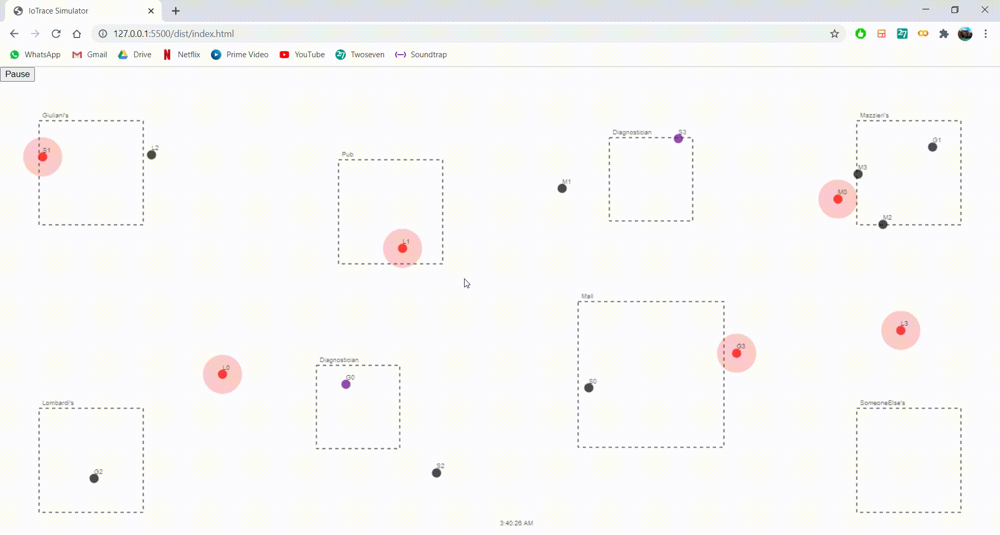

# IoTrace

A contact tracing app built using the IOTA Tangle and based on geo-spatial information about the agents.  
This project is inspired by the [BeepTrace](https://ieeexplore.ieee.org/document/9203904) paper.

## Install

After cloning the repo, you only need to run

```bash
npm install
```

and all the dependencies required to run the project should be satisfied. Obviously, you must have `node` and `npm` installed on your OS.

## Execute

First compile the project running

```bash
npm run build
```

Then go inside `dist` and open a live server there.

## Development

If you run the following command

```bash
npm run watch
```

You can edit any file in `src` and automatically new changes will be recompiled in the `dist` folder.

## Compatibility

Due to the use of experimental JS features for parallelization, compatibility is guaranteed only for **Chromium based browsers** (e.g. Google Chrome, Brave).


